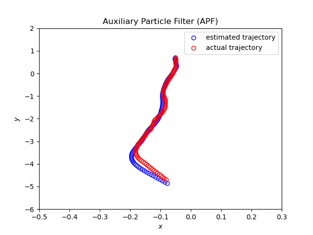

# Particle Filtering
This repository includes **Emadaldin's Mozafari-Majd** attempt to use Bootstrap Particle Filter and Auxiliary Particle Filter for the problem of tracking a moving object in a two-dimensional
enviornment. The simulations were conducted via Python programming language.

----
## Getting started
### Prerequisites

Python 3.10 was used for development.
Install the libraries provided in the requirements.txt file, for example by using
```bash
pip install -r requirements.txt
```

### Results



